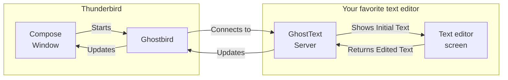

# Ghostbird: GhostText for Thunderbird :nest_with_eggs::mailbox::ghost:

[][tb] 
[][rels]
[][rels] 

A [GhostText][gt] implementation for the [Thunderbird][tb] email client.

This repo contains an in-development Thunderbird add-on that works as a [GhostText client][protocol] in the mail compose window, so that users can write their emails in their favorite text editor like Vim (provided the text editor already has a GhostText add-on installed).

## Requirements

* [Thunderbird 140][tb] (We will mainly support ESR releases)
* A text editor that has a GhostText server add-on installed and running:

  [![Sublime Text][sublimetext-svg]](https://sublime.wbond.net/packages/GhostText)
  
  [![Visual Studio Code][vscode-svg]](https://marketplace.visualstudio.com/items?itemName=fregante.ghost-text)
  [![GNU Emacs][emacs-svg]](https://melpa.org/#/atomic-chrome)
  [![Vim][vim-svg]](https://github.com/raghur/vim-ghost)
  [![Neovim][nvim-svg]](https://github.com/subnut/nvim-ghost.nvim)
  
  [][helix]
  [`$ANY_EDITOR`](https://github.com/newsch/GhostText-Any/)

  The last two implementations can wrap any editor that behaves like Notepad.

## Installation

[][bird]

This add-on is not yet available on [addons.thunderbird.net](https://addons.thunderbird.net/). You can install it manually or build it from source.

### Manual Installation

1. Download the latest release from [Releases][rels].
2. In Thunderbird, go to `Add-ons Manager` and Press :gear: button at the top-right.
3. Select `Install Add-on From File...` from the menu.
4. Select downloaded `.xpi` file.

### Build from source

Basically `yarn && yarn build`. See [CONTRIBUTING.md](./CONTRIBUTING.md) to get started.

## Usage

1. Launch your favorite text editor.
2. Start GhostText server in your text editor (e.g. with `:GhostTextStart` in Vim).
3. Press the gray Ghostbird button  in the Thunderbird mail compose window. (The default shortcut is `Ctrl-E`)
   * If the connection is successful, the button will turn blue .
   * If the connection fails, the button will turn red . Make sure that the GhostText server is listening. See [Troubleshooting page of original GhostText](https://ghosttext.fregante.com/troubleshooting/#unable-to-connect).
4. Write your email in the text editor.
5. Close your text editor to stop Ghostbird.

* Example using Notepad++ via GhostText-Any

  

## How it works

* See [design.md](./doc/design.md) for details.

## Roadmap

### Legend

|Mark|Meaning|Description|
|----|----|----|
|:white_check_mark:|Done|Released in previous version|
|:nest_with_eggs:|Experimental|Released recently; Please try and tell us if you notice something|
|:construction:|WIP|In development, but not released|
|:white_large_square:|Planned|Have to be implemented to release the version|
|:no_entry:|Limitation|The version will be released with this limitation|

### v0.0.1 (Alpha) - Current

* :nest_with_eggs: Prepare the project skeleton (README, build, test, lint, debug, CI)
* :nest_with_eggs: Start button on the toolbar
* :nest_with_eggs: Edit plain text emails
* :nest_with_eggs: Keyboard shortcuts
* :construction: Roadmap and [Project board][proj]
* :no_entry: Non-bidirectional: Thunderbird becomes read-only while Ghostbird is active
* :no_entry: No i18n: the UI is only in English*
* :no_entry: Quirky when editing HTML emails

>\*GhostText communicates only in UTF-8, so you can safely write emails in any language.

### v0.1.0 (Alpha) - 2025 Q3

* :construction: Debug

### v0.x.x (Beta) - 2025 Q4

* :white_large_square: Website with some screenshot
* :white_large_square: Basic option (at minimum, the port of the GhostText server)
* :white_large_square: Prepare for i18n (Make texts translatable)
* :white_large_square: Smoother editing of HTML emails

### v1.0.0 (Stable) - 2026 Q2

* :white_large_square: Publish on AMO (functionally identical to the last beta)

### v1.x.x (Stable) - 2026 Q4

* :white_large_square: Edit Address and Subject fields
* :white_large_square: Continue i18n (Add more languages)
* :white_large_square: Support text editors that lack a GhostText add-on (e.g., Notepad)*
* :white_large_square: Automate AMO release on GitHub

> \*Requires protocol extension and server-side support. I intend to develop one by forking [GhostText-Any](https://github.com/newsch/GhostText-Any/).

### v2.x.x (Future)

* Proper implementation as a GhostText client
  * :white_large_square: Cursor and selection synchronization
  * :white_large_square: Bidirectional editing; changes in Thunderbird are reflected in the text editor

* :white_large_square: Better handling of conflicts, disconnection and reconnection (possibly extending the protocol)

### Non-goals

* Editing text boxes other than the email compose window in Thunderbird
* WYSIWYG editing for HTML emails
* Thunderbird Mobile support

## Contributing

If you liked the idea, please:

* [Star the repo](#repository-container-header).
* Feel free to open issues and submit pull requests. See [CONTRIBUTING.md](./CONTRIBUTING.md) to get started.
* See our [project board][proj] or [issues](https://github.com/exteditor/ghostbird/issues) for tasks you can contribute to, and use the [Discussions](https://github.com/exteditor/ghostbird/discussions) page for general discussions.

### Help wanted

We need help with:

* [Website](https://exteditor.github.io/ghostbird/) and materials (Please post [screenshots to the wiki](https://github.com/exteditor/ghostbird/wiki/Screenshots))
* [Testing with various text editors](https://github.com/exteditor/ghostbird/wiki/Text_editors_known_to_work_with)
* [Testing with various OSes](https://github.com/exteditor/ghostbird/wiki/OSes_known_to_work_with)
* Wiki pages for [user guides](https://github.com/exteditor/ghostbird/wiki/HowTo) and [troubleshooting](https://github.com/exteditor/ghostbird/wiki/Troubleshooting)
* Developing the server counterpart so that this can be used as an External Editor replacement ([GhostText-Any](https://github.com/newsch/GhostText-Any/) or [Helix-Ghost][helix] can be a good starting point)
* Creating a testing checklist for testing and debugging ([This page](https://github.com/exteditor/exteditor/wiki/Things-to-test) can be a good starting point)
* Automating test with the real Thunderbird (See [Testing](./doc/testing.md))
* Organization members (I want to increase [the bus factor](https://en.wikipedia.org/wiki/Bus_factor) of [the organization](https://github.com/exteditor/))

## FAQ

### Is it safe to use?

* I'd say yes, but save your work frequently since it may contain bugs and eat your email.
* This add-on does not collect any personal data and can only connect to localhost. Attempts to send any data to external servers are blocked by Thunderbird's security model.
* You can look inside the released `.xpi` files (which are just zip files) to verify that it matches the build from the source code.
* As for trustworthiness, the safest option is to wait until it is published on AMO, as that indicates it has passed Mozilla's review process.

### Why not just fork the original GhostText add-on, or contribute to it?

* See [faq.md](./doc/faq.md#why).

### When will it be available on addons.thunderbird.net?

* See [Roadmap](#roadmap) for the planned release schedule.

### How do I set up a development environment?

* See [CONTRIBUTING.md](./CONTRIBUTING.md) for details on the development workflow.

### How do I troubleshoot connection issues?

* Make sure that the GhostText server is listening. See the [Troubleshooting page of original GhostText](https://ghosttext.fregante.com/troubleshooting/#unable-to-connect).

### How do I switch between HTML mode and Plain Text mode?

* See [doc/faq.md](./doc/faq.md#mode).

### How can I support the project?

Please consider the following options:

* [Star the repo](#repository-container-header)
* [Donate to Thunderbird](https://www.thunderbird.net/en-US/donate/) (It's financially separate from Firefox)
* [Donate to @fregante, the author of the original GhostText](https://github.com/sponsors/fregante)
* [Contribute to the development](#help-wanted)

If you've looked at the options above and still want to motivate the maintainer [@snipsnipsnip](https://github.com/snipsnipsnip) specifically, you can tip some [ETH](https://gist.githubusercontent.com/snipsnipsnip/d0b0bd12045060c8f71fbc9ea936d886/raw/a840747caa6cac61d0bd3b59145e6ed7e9daf14f/eth.json).

## Credits

* [Federico Brigante](https://fregante.com/), the author of [GhostText][gt].
* [Alexandre Feblot](https://github.com/afeblot), the original author of [External Editor](https://github.com/exteditor/exteditor/), which I took over maintaining; it is now in a stale state. I intend to incorporate some of its features into Ghostbird.
* The button image is based on [photo](https://commons.wikimedia.org/wiki/File:Grey-headed_Bushshrike_(Malaconotus_blanchoti)_in_tree,_crop.jpg) of a [Grey-headed Bushshrike][bird] by [Patty McGann](https://www.flickr.com/photos/10374910@N08/3093177192/) (CC-BY-2.0).

### Tools

## License

 
Ghostbird is [dual-licensed under (MPL-2.0 OR GPL-3.0-or-later)](./LICENSE). See also [NOTICE](./ext/NOTICE.md).

[proj]: https://github.com/exteditor/ghostbird/projects
[tb]: https://thunderbird.net/
[gt]: https://ghosttext.fregante.com/
[helix]: https://github.com/rahji/helix-ghost
[rels]: https://github.com/exteditor/ghostbird/releases
[sublimetext-svg]: ./doc/res/sublimetext.svg
[vscode-svg]: ./doc/res/vscode.svg
[emacs-svg]: ./doc/res/emacs.svg
[vim-svg]: ./doc/res/vim.svg
[nvim-svg]: ./doc/res/nvim.svg
[bird]: https://en.wikipedia.org/wiki/Grey-headed_bushshrike
[protocol]: https://github.com/fregante/GhostText/blob/refs/heads/main/PROTOCOL.md
