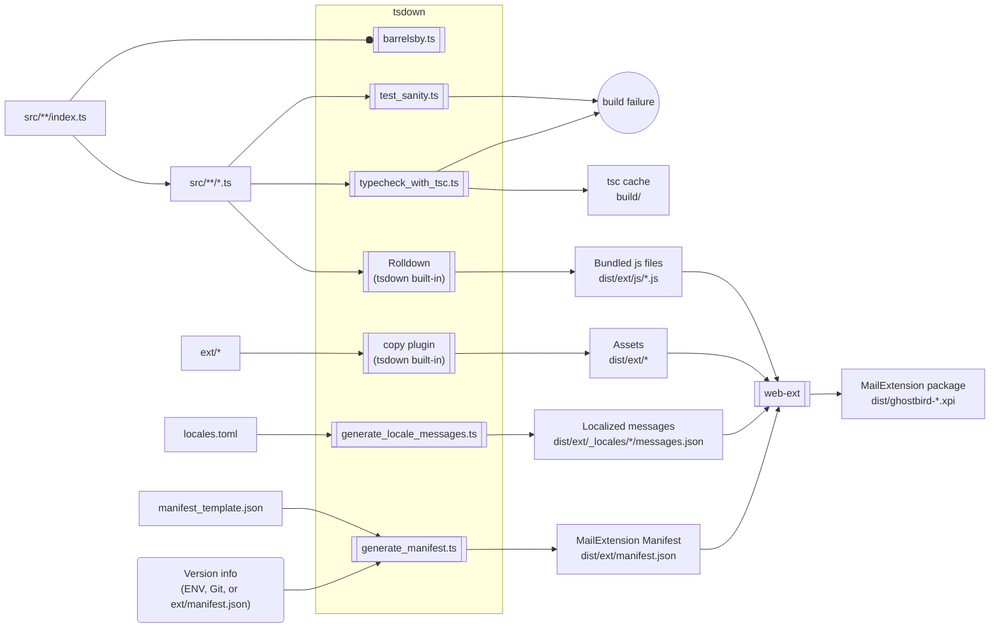

# Building Ghostbird

[`tools/tsdown_config.ts`](../tools/tsdown_config.ts) serves as the build script of Ghostbird. It makes heavy use of custom plugins, which would have resulted in very long comments, so I felt they deserved separate documentation.

## Inputs and Outputs

## Overview

- Running `yarn build-js` starts [the `tsdown` tool](https://tsdown.dev/), which performs several tasks.
    - Generating `index.ts` (barrel exports).
    - Running sanity tests.
    - Performing a type check.
    - Generating `manifest.json` from the template file.
    - Generating localized `messages.json` files.
    - Adjusting source maps.
    - Copying static assets from `ext/` into `dist/ext/`.
    - Compiling bundled JavaScript files into `dist/ext/`.
- Running `yarn build-xpi` creates a zip archive named `dist/ghostbird-{version}.xpi`.
   - [The `web-ext` tool](https://github.com/mozilla/web-ext#web-ext) does the actual work.
- The usual `yarn build` runs both of the above after running the linter and tests.
- `yarn watch` is an alias for `yarn build-js --watch`, which runs the build continuously.

## Build modes

- It is a release build if:
    - the `CI` environment variable is set, or
    - `ext/manifest.json` exists.
- Otherwise, it is a development build.

`ext/manifest.json` is not committed to the repository, and is manually copied from a previous build to override the manifest template.

### Output differences

The output of development and release builds is identical except for the source maps and version number calculation.

- In a development build, source maps have absolute paths to source files to make debuggers happy.
- In a release build, source maps have relative paths to source files that share a common parent directory so that they look organized in the Thunderbird debugger.

## Rollup plugins

The build script uses several custom plugins, each serving a different purpose:

1. [`tools/barrelsby.ts`](../tools/barrelsby.ts) generates `index.ts` barrel files.
1. [`tools/test_sanity.ts`](../tools/test_sanity.ts) runs basic test cases to catch common mistakes.
   - This is skipped in a release build since a full `yarn test` is run as a pre-build step.
1. [`tools/typecheck_with_tsc.ts`](../tools/typecheck_with_tsc.ts) runs `tsc --build`.
   - `tsdown` doesn't check types, so we have to run it separately.
   - This is skipped in a release build since a full `yarn check-type` is run as a pre-build step.
1. [`tools/generate_manifest.ts`](../tools/generate_manifest.ts) prepares `manifest.json` by filling in placeholders in [`manifest_template.json`](../manifest_template.json).
1. [`tools/generate_locale_messages.ts`](../tools/generate_locale_messages.ts) generates [message files](https://developer.mozilla.org/en-US/docs/Mozilla/Add-ons/WebExtensions/Internationalization) from the definition in [`locales.toml`](../locales.toml).

### Version number calculation in `generate_manifest.ts`

The version number included in `manifest.json` is calculated in `generate_manifest.ts`.

The build script assumes four use cases, each using a different source of version information:

1. The CI system builds the extension for distribution.
   - In this case, environment variables contain version information, so it produces a release build with a version number derived from the pushed Git commit.
   - The version number will look like `1.2.3.228825662` or `nightly-main-da39a3ee5e6b4b0d3255bfef95601890afd80709`.
   - The fourth part is a truncated Git commit ID in decimal.
2. A release maintainer (or a security-conscious user) tries to reproduce a release build from a tarball.
   - In this case, `ext/manifest.json` is present, so it produces a release build using it.
   - The version number will look like `1.2.3.228825662`.
3. A developer builds the extension for debugging.
   - In this case, `git describe` works, so it produces a development build with a version number derived from Git commit information.
   - The version number will look like `1.2.3+74.g6d0ce74.dirty`.
4. A user builds the extension for their own use from a tarball.
   - In this case, the source code lacks Git version information, so it produces a development build with a dummy version number that includes a timestamp.
   - The version number will look like `0.0.1893501296000`.

## Build reproducibility

- Building with `ext/manifest.json` should produce identical results to one from CI in terms of file names and their contents.
- However, they will have different timestamps and file order, meaning Ghostbird builds are not strictly reproducible.
- It would be possible to wipe `mtime`s to produce strictly identical zips, but this was considered pointless as AMO repackages the zip when signing the add-on anyway.
- See [the issue page for the `web-ext` tool](https://github.com/mozilla/web-ext/issues/2381#issuecomment-1075667618) for details.
