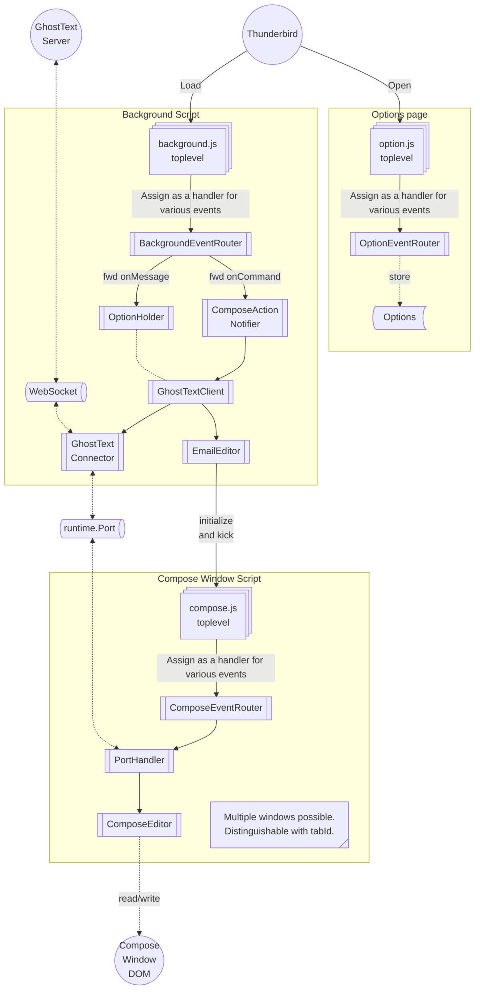
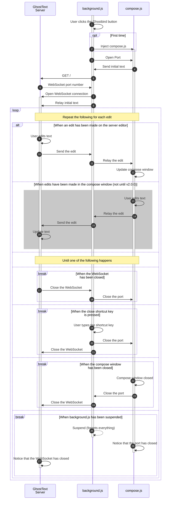
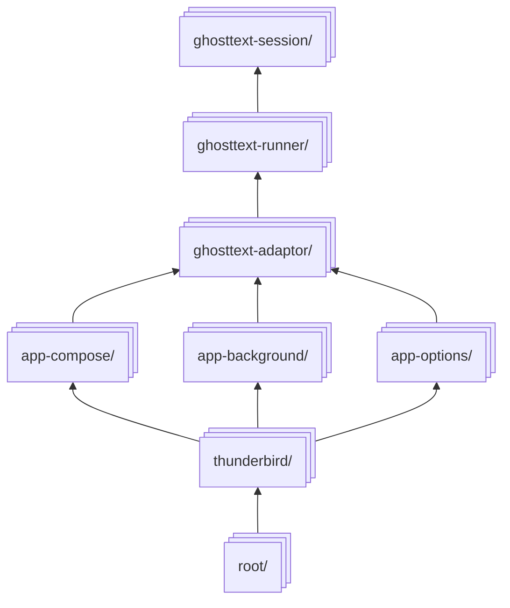
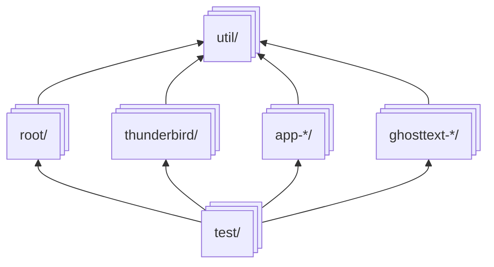
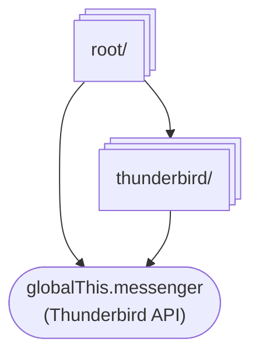
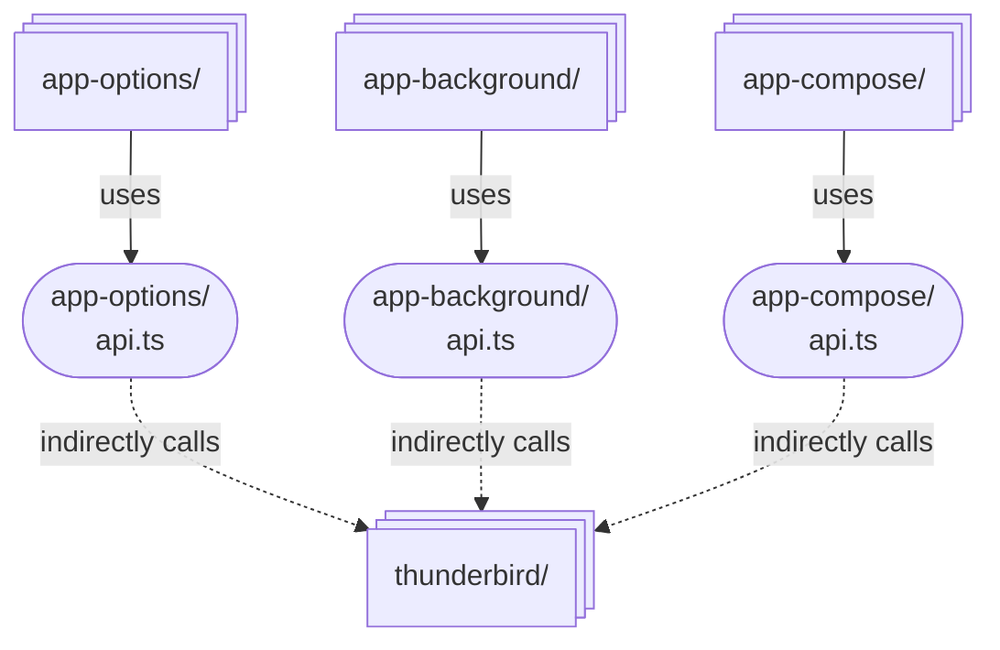
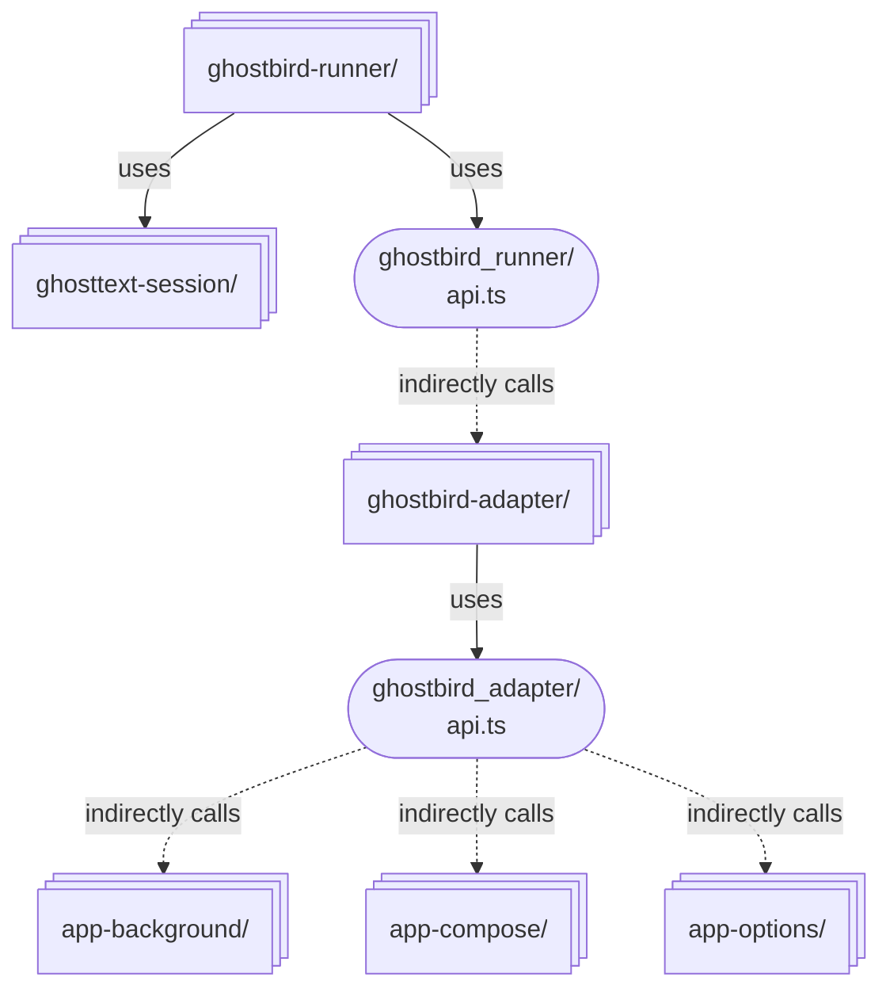
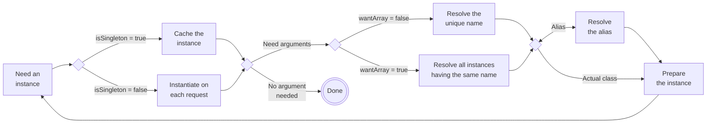

# Design

## How it works

### Some diagram that's between a component diagram and a call graph

The diagram below is an initial sketch, so class names may differ from the current codebase.

### Sequence diagram

Here's a sequence diagram showing interactions between `background.js`, `compose.js` and the GhostText server when the user clicks the Ghostbird button in the compose window.

## User interactions

This is how user actions are handled:

### The Ghostbird button

1. The Ghostbird button is clicked in the compose window.
1. The background script `background.js` responds to the event and starts a WebSocket connection to the GhostText server. (See [the protocol document][protocol] for details)
1. `background` injects `compose.js` into the compose window.
1. `background` connects to `compose` via a [`Port`](https://developer.thunderbird.net/add-ons/webextensions/api/runtime/port).
1. `background` reads text content from the compose window.
1. `background` sends the text to the GhostText server via WebSocket.
1. The text editor shows the received text.
1. Having established the connection, Thunderbird and the text editor can now synchronize text.
    * When the text is changed in the text editor, the server sends the update to `background`, which relays it to `compose`, which updates the compose window.
    * ~~When the text is changed in the compose window, `compose` sends the update to `background`, which relays it to the server, which updates the text editor.~~ (Not until v2.0.0)
1. The WebSocket connection remains open until one of the following happens:
    * `a)` When the server closes the WebSocket connection, which `background` detects and closes the Port.
    * `b)` When the shortcut key to stop is pressed, `background` closes both the Port and the WebSocket connection.
    * `c)` When the compose window is closed, the Port closes, which is detected by `background` and the WebSocket connection is closed.
    * `d)` When Thunderbird suspends the `background` script, both the WebSocket and the Port will close.
1. The compose window returns to its normal state and the button is toggled off.

### The options page

1. The options page is opened from Thunderbird's add-on manager.
1. `options.js` runs and loads saved settings from `browser.storage.local`.
1. The user changes settings and clicks "Save".
1. `options.js` saves the settings to `browser.storage.local`.
1. The next time the Ghostbird button is clicked, `background.js` reads the saved settings from `browser.storage.local` and uses them.

### Quirks and limitations

* Because of [MV3 limitations][so], `background.js` may occasionally be suspended (all variables including WebSockets are unloaded, so it's effectively terminated).
  * We do our best to prevent it, but ultimately it's up to Thunderbird.
* We don't implement reconnecting the WebSocket connection when it is closed abnormally. The user has to click the Ghostbird button again to reconnect.
* Connections will also close when the user updates the add-on.
  * It will be handled similarly to the case `(b)`.
* Initially, we don't support edits made in the compose window. We aim to support it in v2.0.0, but copying what the original GhostText add-on does might work well enough. We'll see.

## Tooling

* [tsc](https://www.typescriptlang.org/), [typedoc](https://typedoc.org/), [tsdown](https://tsdown.dev/), [Biome](https://biomejs.dev/), and [Vitest](https://vitest.dev/).
  * See [`package.json`](../package.json).
  * See [CONTRIBUTING.md](../CONTRIBUTING.md#code-style) for the code style.

* [Barrelsby](https://github.com/bencoveney/barrelsby)  generates `index.ts`.
  * See [building.md](./building.md) for details on build script internals.

## Structure of the code

The code loosely follows the [Ports and Adapters architecture](https://8thlight.com/insights/a-color-coded-guide-to-ports-and-adapters) and adheres to the [Dependency Inversion Principle](https://en.wikipedia.org/wiki/Dependency_inversion_principle).
* Interface implementations are preferred over class inheritance.
  * Fortunately, wrapping everything in interfaces is often unnecessary in TypeScript.
* Exported classes are preferred over exported functions, unless a function is unlikely to be swapped out for another implementation.
* That said, we don't go overboard with design patterns. We don't turn it into a Visitor just to pass a callback; feel free to use lambdas.
* I'm trying this in the hope that it makes it easier to [test](./testing.md), [extend](#about-startup_ts), and [maintain](./faq-architectural.md) the code, not for philosophical reasons.

### Files

The source code is located in the `src/` directory. The main files are:

- `src/root/background.ts`: A background script that manages the WebSocket connection to the GhostText server and relays messages between the compose script and the server. Bundled as `background.js`.
- `src/root/compose.ts`: A compose script that adds a button to the mail compose window. Bundled as `compose.js`.
- `src/root/options.ts`: An options page for configuring settings such as the server URL and text editor to use. Bundled as `options.js` and used by `ext/options.html`.

Other directories are:

- `src/app-background/`: Infrastructure of `background.ts` that handles Thunderbird events.
- `src/app-compose/`: Infrastructure of `compose.ts` that handles Thunderbird events.
- `src/app-options/`: Infrastructure of `options.ts` that handles Thunderbird events.
- `src/ghosttext-session/`: Main module of the add-on implementing the protocol.
- `src/ghosttext-runner/`: Facilitator that works together with `ghosttext-session` which feeds events into it and execute decisions made.
- `src/ghosttext-adaptor/`: Helpers of `ghosttext-runner`.
- `src/test/`: Test code.
- `src/thunderbird/`: Wrapper of the Thunderbird MailExtension API.
- `src/util/`: Utility modules used by multiple modules.

### Module Dependencies

The arrows in diagram below point from the dependent to the dependency.

* All `src/*/index.ts` export everything in the same folder, so practically these folders are equivalent to modules.
* `root/` contains entry points and depends on all other modules except `test/`.
* `ghosttext-session/` doesn't depend on other modules.
* `ghosttext-adaptor/` depends on `ghosttext-runner/`, which depends on `ghosttext-session/`.

* `util/` can be used by any modules, and they don't depend on other modules.
* `test/` can reference all other modules.

### Callgraphs

* Modules don't  use Thunderbird API directly, except `root/` and `thunderbird/`.
  * Other modules define subsets of the Thunderbird API they use as interfaces in `api.ts` files in their directories, which are implemented by `thunderbird/` modules.

* `api.ts` defines subsets of the Thunderbird API used by the module in the folder.
* These interfaces are implemented by `thunderbird/` modules.
* This is to isolate the impact of future Thunderbird API changes to `src/thunderbird/` modules only.

* Likewise, `ghostbird-adapter/` doesn't depend on `app-*/` and call them through `api.ts`.
* `ghostbird-runner/` doesn't depend on `app-adapter/` and call them through `api.ts` too.
* `ghostbird-session/` doesn't have `api.ts`, as it's the core module.

### About `startup_*.ts`

TL;DR: `root` module contains entry point and the [Composition Root][ploeh].

* `root/startup/startup_{background,compose,options}.ts` is used at the toplevel modules, namely `background.ts`, `compose.ts`, and `options.ts`. It initializes classes.
* All the non-root classes in the codebase are either:
  * A) instantiated by `startup*()`, or
  * B) instantiated directly with `new` operator by instances of (A).
* All (A) classes have a property `static isSingleton: boolean`.
* `startup*()` returns a factory on steroids; it scans classes that have a `static isSingleton` property and instantiates them.
  * Instantiated classes are passed to the constructors of dependent classes, which must also define `static isSingleton`.
* `static isSingleton: boolean` indicates whether and how the class should be instantiated:
  * If `true`, only one instance is created and shared.
  * If `false`, a new instance is created each time it is needed.
  * If `undefined` or the property is missing, the class is not instantiated automatically. Attempting to request it from automatically instantiated classes will result in an error.
* If a class wants to use another class, it should have a constructor parameter and a property having the same name as the class name (case-insensitive).
* A class may also have `static wantArray = true` to allow duplicate entries:
  * If `true`, each argument to the constructor will be an array of one or more instances that have the same name.
  * If `false`, `undefined`, or the property is missing, each argument to the constructor will be an instance of the class that has the name uniquely.
* A class may define `static aliases: string[] | string` to have the other name.
  * Name clashes will result in error at startup, except ones passed to classes with `wantArray = true`.
* Use of automatic instantiation must be restricted to `root/` to make the code easier to follow.
* `test/startup.test.ts` contains tests to verify that all classes registered can be instantiated successfully.
* See [FAQ](./faq-architectural.md) for some design decisions and justification.

## Links

* [GhostText protocol][protocol]
* [Ghostbird Wiki][wiki]
* [About Thunderbird Add-on development](https://developer.thunderbird.net/add-ons/about-add-ons)
  * [Thunderbird MailExtension Development Resources](https://developer.thunderbird.net/add-ons/resources)
  * [Supercharge your Thunderbird extension debugging](https://arndissler.net/supercharge-your-thunderbird-extension-debugging/)
* [Composition Root location][ploeh]
* [Does the entire code in the top level of the manifest v3 service worker run repeatedly every time it wakes up? - Stack Overflow][so]

[tbchanges]: https://developer.thunderbird.net/add-ons/updating/tb128
[protocol]: https://github.com/fregante/GhostText/blob/main/PROTOCOL.md
[ploeh]: https://blog.ploeh.dk/2019/06/17/composition-root-location/
[wiki]: https://github.com/exteditor/ghostbird/wiki
[so]: https://stackoverflow.com/q/73206468/188256
